# Micro-Expression for Lie Detection

**Báo cáo môn học**

Sinh viên/Nhóm: ................................................
MSSV: ...........................................................
Môn học: Nhận dạng mẫu
Giảng viên: .....................................................
Ngày nộp: .......................................................

---

## Tóm tắt

Phát hiện nói dối từ video là một bài toán khó vì tín hiệu phân biệt thường yếu, không ổn định và chịu ảnh hưởng mạnh bởi người nói, bối cảnh, chất lượng khuôn mặt và âm thanh. Báo cáo này xây dựng một pipeline học sâu đa phương thức cho đề tài **Micro-Expression for Lie Detection**, tập trung vào ba nguồn tín hiệu: đặc trưng khuôn mặt tĩnh, chuyển động khuôn mặt qua optical flow và tín hiệu âm thanh. Toàn bộ quá trình huấn luyện, chọn mô hình, hiệu chỉnh ngưỡng và đánh giá chính đều được thực hiện trên bộ dữ liệu DOLOS theo giao thức 3-fold.

Pipeline sử dụng `faces_224_clean`, `optflow_clean` và `face_valid` để giảm ảnh hưởng của nhiễu khuôn mặt. Về mô hình, báo cáo thử nghiệm hai hướng chính: cross-attention giữa audio và visual, và gated logit fusion có prior-KL để kết hợp ba stream ở mức logits. Biến thể cross-attention cuối cùng dùng thêm **soft temporal penalty** nhằm khuyến khích attention ưu tiên các token gần nhau theo thời gian nhưng không cấm hoàn toàn các liên kết xa. Kết quả tốt nhất là prediction-level ensemble giữa soft temporal cross-attention và gated prior-KL temporal-mask, đạt AUC trung bình **65.43%**, balanced accuracy sau hiệu chỉnh ngưỡng **60.54%** và F1 cho lớp lie **61.39%** trên DOLOS 3-fold. Kết quả cho thấy mô hình học được tín hiệu phân biệt trong DOLOS, nhưng độ ổn định còn chịu ảnh hưởng rõ bởi host, episode và chất lượng face tracking.

---

## Danh mục bảng và hình chính

| Mã | Nội dung | Vị trí file |
| --- | --- | --- |
| Hình 1 | Tổng quan bài toán và pipeline | `figures/report/fig01_problem_pipeline.png` |
| Hình 2 | Vùng biểu cảm khuôn mặt | `figures/report/fig02_micro_expression_regions.png` |
| Hình 3 | Biến thiên nội bộ DOLOS | `figures/report/fig03_dolos_internal_variation.png` |
| Hình 4 | Pipeline tiền xử lý | `figures/report/fig04_preprocessing_pipeline.png` |
| Hình 5 | Three-stream architecture | `figures/report/fig08_three_stream_architecture.png` |
| Hình 6 | Cross-attention block | `figures/report/fig09_cross_attention_block.png` |
| Hình 7 | Gated logit fusion | `figures/report/fig10_gated_logit_fusion.png` |
| Hình 8 | Prediction-level ensemble | `figures/report/fig11_prediction_level_ensemble.png` |
| Đồ thị 1 | So sánh kết quả DOLOS | `figures/report/graph02_dolos_method_comparison.png` |
| Đồ thị 2 | AUC/BA theo fold | `figures/report/graph03_dolos_per_fold_auc_ba.png` |
| Đồ thị 3 | So sánh với DOLOS paper | `figures/report/graph04_ours_vs_paper_auc.png` |
| Đồ thị 4 | Error theo host/episode | `figures/report/graph06_error_by_host.png`, `graph07_episode_error_heatmap.png` |

---

## 1. Giới thiệu

### 1.1 Bối cảnh

Lie detection từ video là bài toán phân loại một đoạn video ngắn thành hai lớp: **truth** hoặc **lie**. Khác với nhiều bài toán thị giác máy tính thông thường, dấu hiệu nói dối không nhất thiết xuất hiện dưới dạng vật thể rõ ràng. Các tín hiệu có thể là thay đổi rất nhỏ ở vùng mắt, lông mày, miệng, chuyển động đầu, độ ngập ngừng trong giọng nói hoặc sự lệch pha giữa âm thanh và biểu cảm.

Micro-expression được xem là một nhóm tín hiệu quan trọng vì các biểu cảm rất ngắn và khó kiểm soát có thể phản ánh trạng thái cảm xúc thật. Tuy nhiên, micro-expression không nên được xem là bằng chứng duy nhất của nói dối. Trong thực tế, biểu cảm mặt, chuyển động, âm thanh và bối cảnh người nói đều có thể ảnh hưởng đến dự đoán. Vì vậy, báo cáo này tiếp cận bài toán theo hướng **multimodal learning** thay vì chỉ dựa vào một nguồn tín hiệu.

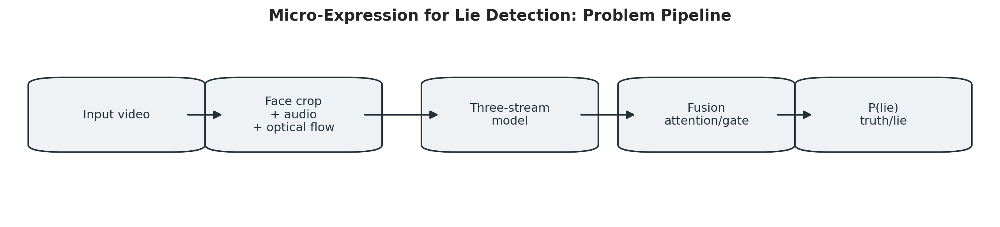

### 1.2 Mục tiêu

Mục tiêu của báo cáo gồm bốn phần:

1. Xây dựng pipeline tiền xử lý DOLOS gồm audio, face crop, face validity mask và optical flow.
2. Huấn luyện các mô hình đa stream kết hợp spatial, flow và audio.
3. So sánh các chiến lược fusion: cross-attention, gated logit fusion và prediction-level ensemble.
4. Phân tích lỗi theo fold, host, episode và chất lượng face tracking để đánh giá độ ổn định của mô hình.

### 1.3 Phạm vi

Phạm vi chính của báo cáo là **DOLOS-only**. Toàn bộ train, validation, test, chọn checkpoint, hiệu chỉnh threshold và grid-search ensemble weight đều dùng các split DOLOS. Báo cáo không dùng kết quả từ tập dữ liệu ngoài DOLOS làm kết luận chính để tránh sai lệch protocol.

---

## 2. Cơ sở lý thuyết và công trình liên quan

### 2.1 Micro-expression trong phát hiện nói dối

Micro-expression là các biểu cảm thoáng qua, thường có cường độ nhỏ và xuất hiện trong thời gian ngắn. Trong bối cảnh deception detection, micro-expression có thể là dấu hiệu của cảm xúc bị che giấu hoặc phản ứng không tự chủ. Các vùng thường được quan tâm gồm mắt, lông mày, khóe miệng, cơ quanh má và chuyển động đầu.

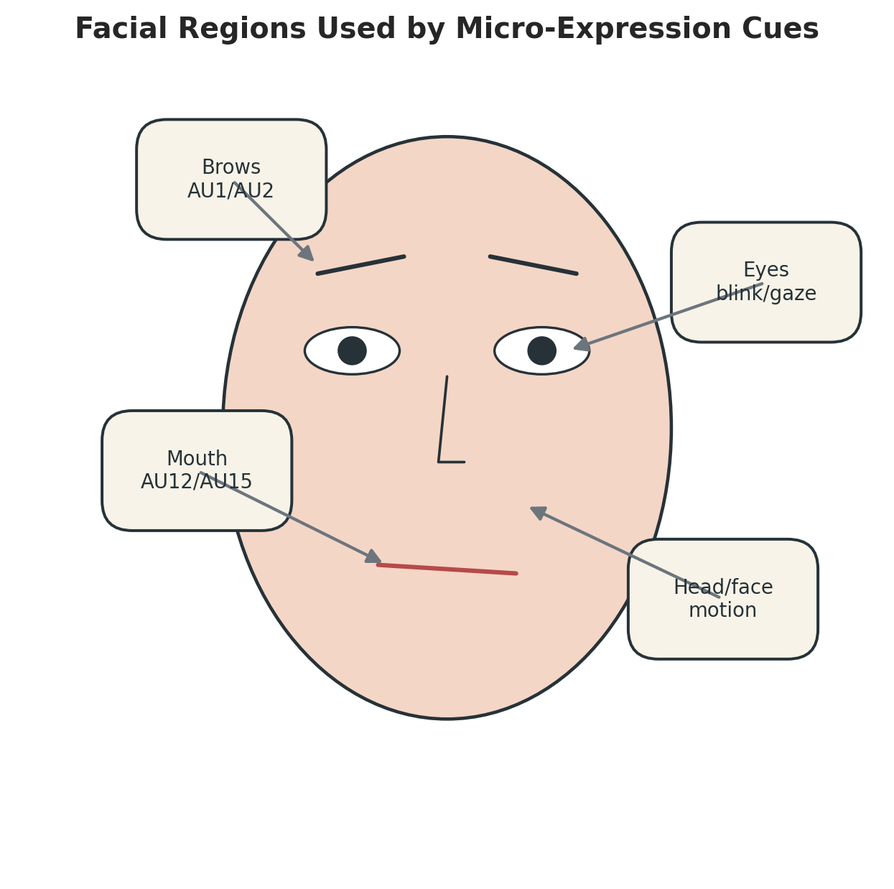

Điểm khó là micro-expression không luôn xuất hiện, không luôn liên quan trực tiếp đến nói dối và có thể bị nhiễu bởi ánh sáng, góc quay, người khác xuất hiện trong frame hoặc face tracking sai. Vì vậy, mô hình cần kết hợp thêm temporal motion và audio.

### 2.2 Audio-visual deception detection

Trong bài toán deception detection, mỗi modality có ưu và nhược điểm riêng:

| Modality | Tín hiệu chính | Rủi ro |
| --- | --- | --- |
| Spatial face | Appearance, biểu cảm tĩnh, vùng mắt/miệng | Dễ học identity/host, nhạy với crop sai |
| Optical flow | Chuyển động mặt, đầu, miệng | Nhạy với tracking, camera cut, nhiễu chuyển động |
| Audio | Prosody, pause, stress, nhịp nói | Có thể học nội dung/host thay vì deception cue |

Do đó, mô hình tốt cần vừa khai thác từng stream, vừa kiểm soát việc phụ thuộc quá mạnh vào một stream không ổn định.

### 2.3 DOLOS paper

DOLOS là bộ dữ liệu audio-visual deception detection được giới thiệu trong bài báo ICCV 2023 “Audio-Visual Deception Detection: DOLOS Dataset and Parameter-Efficient Crossmodal Learning”. Bài báo gốc báo cáo kết quả 3-fold trung bình và cho thấy mô hình PAVF kết hợp multi-task learning đạt kết quả tốt nhất.

| Source | Method | ACC | F1 Lie | AUC |
| --- | --- | ---: | ---: | ---: |
| DOLOS paper | Visual | 61.44 | 69.42 | 58.89 |
| DOLOS paper | Audio | 59.19 | 73.46 | 52.54 |
| DOLOS paper | Concatenation | 61.62 | 70.20 | 60.50 |
| DOLOS paper | PAVF | 64.75 | 71.20 | 62.71 |
| DOLOS paper | PAVF + Multi-task | 66.84 | 73.35 | 64.58 |

Điểm khác biệt quan trọng là báo cáo này không dùng annotation multi-task như bài gốc. Pipeline tập trung vào các đặc trưng có thể trích xuất trực tiếp từ video/audio và các cơ chế fusion khả thi trong phạm vi môn học.

---

## 3. Dữ liệu và giao thức đánh giá

### 3.1 DOLOS dataset

DOLOS gồm các clip từ chương trình “Would I Lie To You?”, trong đó mỗi clip được gán nhãn truth hoặc lie. Trong báo cáo này, DOLOS được dùng cho toàn bộ quá trình huấn luyện và đánh giá in-domain.

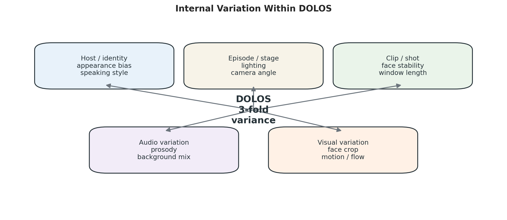

| Fold | Split | Số clip | Truth | Lie | Số host | Số episode |
| --- | --- | ---: | ---: | ---: | ---: | ---: |
| fold1 | train | 857 | 411 | 446 | 5 | 59 |
| fold1 | val | 88 | 36 | 52 | 4 | 8 |
| fold1 | test | 484 | 227 | 257 | 5 | 67 |
| fold2 | train | 832 | 400 | 432 | 5 | 60 |
| fold2 | val | 115 | 45 | 70 | 5 | 7 |
| fold2 | test | 482 | 229 | 253 | 5 | 66 |
| fold3 | train | 835 | 403 | 432 | 5 | 58 |
| fold3 | val | 130 | 52 | 78 | 4 | 9 |
| fold3 | test | 464 | 219 | 245 | 5 | 66 |

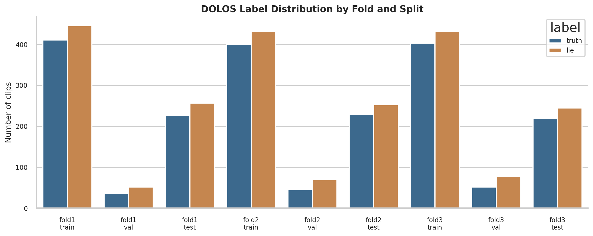

### 3.2 Giao thức 3-fold

Mỗi fold gồm train, validation và test. Train dùng để học tham số mô hình. Validation dùng để chọn checkpoint theo AUC-ROC, hiệu chỉnh threshold theo balanced accuracy và grid-search trọng số ensemble. Test chỉ dùng để báo cáo kết quả cuối.

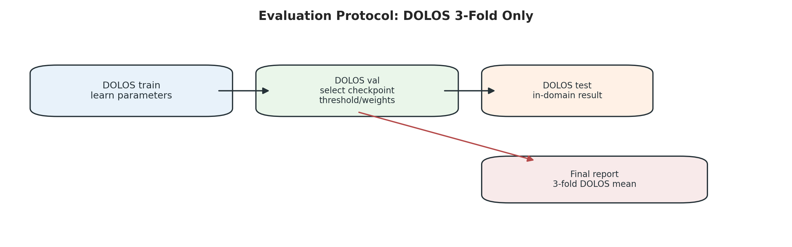

| Stage | Dữ liệu | Vai trò |
| --- | --- | --- |
| Training | DOLOS train folds | Học tham số mô hình |
| Validation | DOLOS validation folds | Chọn checkpoint, threshold và ensemble weight |
| Test | DOLOS test folds | Báo cáo kết quả chính |

### 3.3 Quy định sử dụng dữ liệu

DOLOS được phát hành cho mục đích nghiên cứu/học thuật phi thương mại. Báo cáo này chỉ sử dụng DOLOS trong phạm vi môn học. Khi nộp hoặc công bố artifact, chỉ nên chia sẻ source code, config, bảng metric và đồ thị tổng hợp; không phân phối lại video gốc, annotation gốc, face crops, optical flow hoặc bất kỳ dữ liệu dẫn xuất nào có thể tái tạo dataset.

| Yêu cầu | Cách tuân thủ trong báo cáo |
| --- | --- |
| Academic/non-commercial use | Báo cáo môn học, không thương mại |
| Không phân phối dữ liệu | Không đính kèm raw videos, annotations, crops, flow files |
| Không phát hành dataset dẫn xuất | Chỉ báo cáo aggregate metrics/plots |
| Citation | Trích dẫn DOLOS ICCV 2023 và trang dataset ROSE Lab |

---

## 4. Tiền xử lý dữ liệu

### 4.1 Tổng quan pipeline

Pipeline tiền xử lý gồm bốn nhánh chính: extract audio, phát hiện/crop khuôn mặt, tính face validity và trích xuất optical flow. Các file clean được lưu ở `faces_224_clean` và `optflow_clean`.

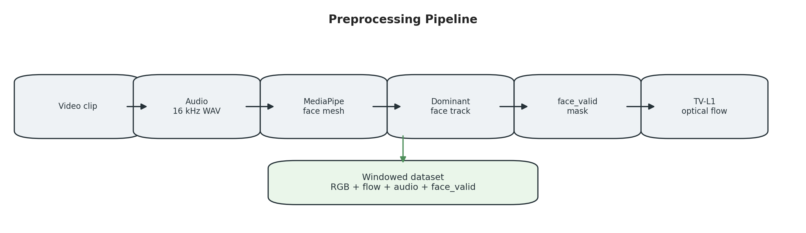

### 4.2 Audio

Audio được trích xuất từ video và đưa về waveform mono 16 kHz. Trong quá trình huấn luyện, mỗi sample dùng cửa sổ 2 giây. Wav2Vec2 được dùng để trích xuất đặc trưng âm thanh, sau đó temporal attention pooling đưa chuỗi audio về 16 token để đồng bộ với visual tokens.

| Thành phần | Giá trị |
| --- | --- |
| Sample rate | 16 kHz |
| Window length | 2 giây |
| Số token đầu ra | 16 |
| Backbone | `facebook/wav2vec2-base` |

### 4.3 Face crop và face_valid

Face preprocessing dùng MediaPipe để phát hiện khuôn mặt và sinh crop 224x224. Vì các clip có thể có nhiều người hoặc camera cut, pipeline clean bổ sung face-track clustering để ưu tiên track ổn định hơn. Với các frame/window không chắc chắn, `face_valid` được dùng làm mask thay vì ép mô hình tin hoàn toàn vào visual stream.

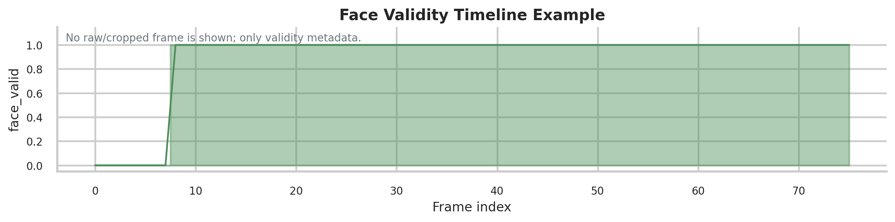

Trong mô hình, `face_valid` được dùng ở hai mức:

1. Mask frame-level khi pooling/attention để giảm ảnh hưởng của frame nhiễu.
2. Điều tiết visual contribution trong gated fusion thông qua gate, tránh phạt kép bằng cách không nhân trực tiếp feature về 0 khi không cần thiết.

### 4.4 Optical flow

Optical flow được trích xuất trên các frame khuôn mặt để biểu diễn chuyển động. Flow stream dùng input 2-channel và ResNet18 đã điều chỉnh convolution đầu vào từ 3 channel sang 2 channel.

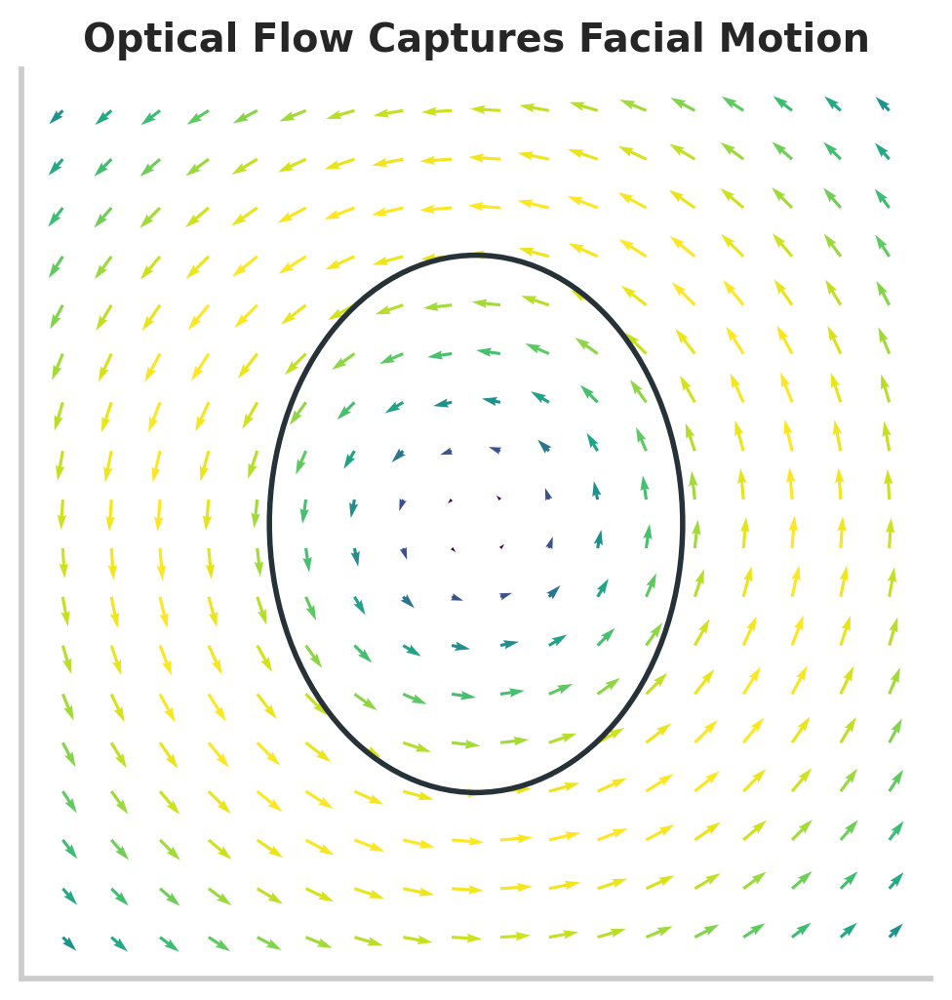

| Thành phần | Giá trị |
| --- | --- |
| Input | 2-channel optical flow |
| Image size | 224x224 |
| Backbone | ResNet18 |
| Projection dim | 256 |
| Missing flow | Zero tensor fallback |

### 4.5 Window aggregation

Mỗi clip được chia thành nhiều window 2 giây. Khi test, mô hình dự đoán score cho từng window, sau đó aggregate thành clip-level score. Clip-level score là đơn vị được dùng để tính metric.

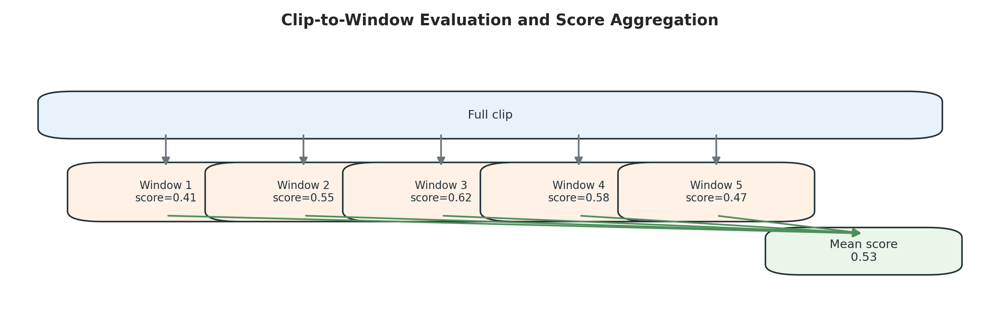

---

## 5. Phương pháp

### 5.1 Kiến trúc three-stream

Mô hình gồm ba stream:

1. **Spatial stream**: face RGB crops qua ViT pretrained cho facial expressions.
2. **Flow stream**: optical flow qua ResNet18 2-channel.
3. **Audio stream**: waveform qua Wav2Vec2-base và temporal attention pooling.

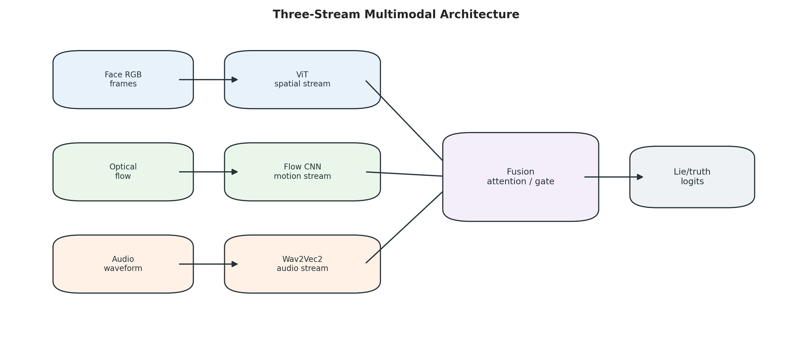

| Stream | Backbone | Frozen | Output dim | Vai trò |
| --- | --- | --- | ---: | --- |
| Spatial | `LaurenGurgiolo/vit-micro-facial-expressions` | Có | 256 | Appearance và facial expression |
| Flow | ResNet18 | Không | 256 | Motion của mặt/đầu/miệng |
| Audio | `facebook/wav2vec2-base` | Có | 256 | Prosody và đặc trưng giọng nói |

### 5.2 Cross-attention fusion

Trong cross-attention, audio tokens đóng vai trò query, visual tokens đóng vai trò key/value. Visual tokens được tạo từ spatial và flow. Cross-attention cho phép mô hình học tương quan giữa âm thanh và biểu cảm/chuyển động tại các thời điểm khác nhau.

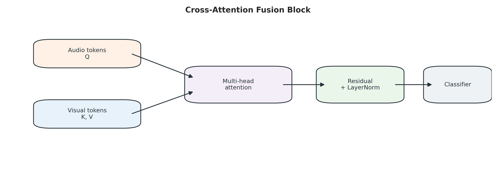

Để tăng ổn định, block dùng:

- LayerNorm riêng cho audio và visual trước attention.
- Residual connection: `attended = audio + dropout(attention(audio, visual))`.
- LayerNorm sau attention.
- BiLSTM/head để tạo logits truth/lie.

### 5.3 Soft temporal penalty cho cross-attention

Cross-attention toàn cục có rủi ro overfit khi audio token tại thời điểm sớm lại gán attention cao cho visual token ở rất xa về thời gian. Hard local attention đã được thử nhưng làm giảm kết quả fold3. Vì vậy, báo cáo dùng một ràng buộc mềm:

`bias(i, j) = -((i - j)^2 / (2 * sigma^2))`

với `sigma = 6.0`. Bias này được cộng vào attention logits trước softmax. Cách này khuyến khích mô hình nhìn gần theo thời gian, nhưng vẫn cho phép liên kết xa nếu score học được đủ mạnh.

| Fold | Clean cross AUC | Soft penalty AUC | Clean calibrated BA | Soft calibrated BA |
| --- | ---: | ---: | ---: | ---: |
| fold1 | 59.12 | 56.86 | 56.42 | 51.46 |
| fold2 | 65.73 | 64.73 | 60.94 | 61.27 |
| fold3 | 56.92 | 64.34 | 52.75 | 58.92 |
| mean | 60.59 | 61.98 | 56.70 | 57.22 |

Soft temporal penalty không mạnh đều trên mọi fold, nhưng giúp fold3 rõ rệt và hữu ích khi dùng làm một nhánh ensemble.

### 5.4 Gated logit fusion với prior-KL

Gated model tạo logits riêng cho từng stream:

`spatial_features -> spatial_head -> logits_s`
`flow_features -> flow_head -> logits_f`
`audio_features -> audio_head -> logits_a`

Sau đó gate network nhận pooled features của ba stream và sinh trọng số:

`gate = softmax(MLP([pooled_s, pooled_f, pooled_a]))`

Logits cuối cùng:

`logits = gate_s * logits_s + gate_f * logits_f + gate_a * logits_a`

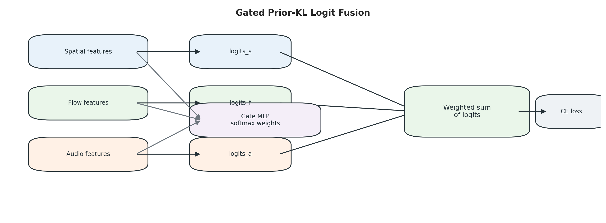

Loss gồm cross entropy cho logits cuối, auxiliary CE cho từng stream và KL prior để gate không phụ thuộc quá mạnh vào spatial stream. Cấu hình prior dùng trọng số khởi tạo `[0.10, 0.45, 0.45]` cho spatial, flow và audio.

### 5.5 Prediction-level ensemble

Sau khi có prediction clip-level từ soft temporal cross-attention và gated prior-KL temporal-mask, báo cáo grid-search trọng số trên validation của từng fold rồi áp dụng lên test. Method cuối cùng là `ensemble_raw_balanced_accuracy`, tức trọng số được chọn để tối ưu balanced accuracy trên validation.

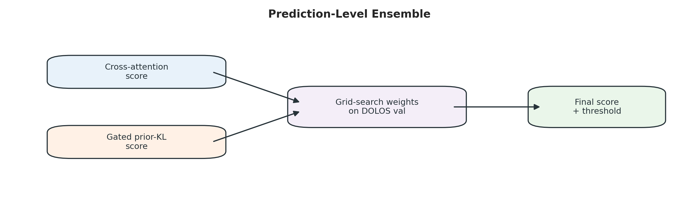

---

## 6. Thiết lập thực nghiệm

### 6.1 Cấu hình train

| Thành phần | Giá trị |
| --- | --- |
| Optimizer | AdamW |
| Learning rate head | 1e-3 |
| Weight decay | 0.01 |
| Scheduler | Cosine warmup |
| Warmup epochs | 3 |
| Batch size | 4 |
| Gradient accumulation | 4 |
| Max epochs | 50 |
| Early stopping patience | 10 |
| Checkpoint metric | Validation AUC-ROC |
| Threshold calibration | Validation balanced accuracy |
| Seed | 42 |
| AMP | Enabled |
| Hardware | RTX 3060 12GB |

### 6.2 Cấu hình dữ liệu

| Tham số | Giá trị |
| --- | --- |
| Face directory | `data/processed/faces_224_clean` |
| Optical flow directory | `data/processed/optflow_clean` |
| Face-valid mode | `ratio` |
| Minimum window face-valid ratio | 0.75 |
| Frames per window | 16 |
| Window length | 2.0 giây |
| Train windows per clip | 3 |
| Sliding stride | 1.0 giây |
| Max windows per clip | 16 |
| Image size | 224 |
| Audio sample rate | 16 kHz |

### 6.3 Metrics

Các metric chính gồm:

| Metric | Ý nghĩa |
| --- | --- |
| Accuracy | Tỷ lệ dự đoán đúng |
| Balanced Accuracy | Trung bình recall của hai lớp, phù hợp khi lớp mất cân bằng hoặc threshold nhạy |
| F1 Lie | F1-score của lớp lie |
| Macro-F1 | Trung bình F1 của hai lớp |
| AUC-ROC | Khả năng xếp hạng truth/lie trên mọi threshold |
| AUC-PR | Precision-recall AUC cho lớp lie |

Trong báo cáo, **AUC-ROC** đánh giá khả năng ranking, còn **calibrated balanced accuracy** phản ánh chất lượng quyết định sau khi chọn threshold trên validation.

---

## 7. Kết quả trên DOLOS

### 7.1 Kết quả chính 3-fold

| Method | AUC | BA@0.5 | Calibrated BA | Calibrated F1 Lie | Calibrated Macro-F1 |
| --- | ---: | ---: | ---: | ---: | ---: |
| Cross-attention AUC baseline | 61.98 | 53.31 | 57.22 | 48.36 | 52.30 |
| Gated logits prior-KL | 64.38 | 55.71 | 59.39 | 60.27 | 59.26 |
| Final ensemble raw-AUC | 65.20 | 54.25 | 60.00 | 59.06 | 59.53 |
| **Final ensemble raw-BA** | **65.43** | **54.90** | **60.54** | **61.39** | **60.13** |

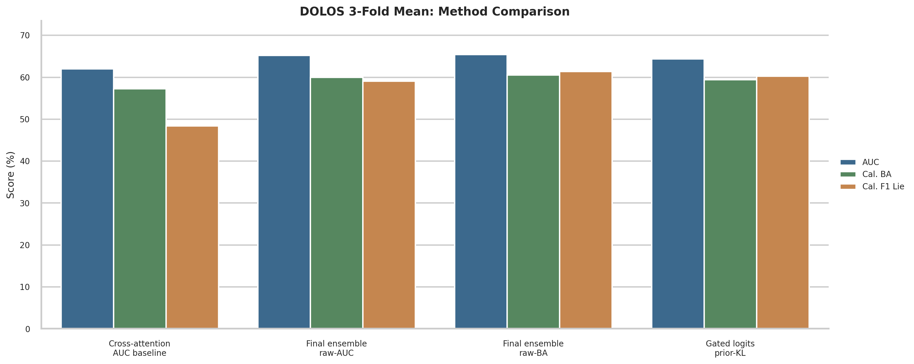

Kết quả cho thấy gated prior-KL là single model mạnh nhất, còn ensemble giữa gated prior-KL và soft temporal cross-attention đạt kết quả tốt nhất tổng thể. So với gated prior-KL, final ensemble tăng AUC từ 64.38 lên 65.43 và calibrated BA từ 59.39 lên 60.54.

### 7.2 Kết quả theo fold

| Fold | Ensemble weights | Threshold | AUC | BA@0.5 | Calibrated BA | Calibrated F1 Lie | Calibrated confusion matrix |
| --- | --- | ---: | ---: | ---: | ---: | ---: | --- |
| fold1 | cross=0.85; gated=0.15 | 0.5001 | 65.41 | 59.83 | 59.63 | 62.98 | `[[125, 102], [92, 165]]` |
| fold2 | cross=1.00; gated=0.00 | 0.5116 | 64.73 | 49.82 | 61.27 | 55.81 | `[[172, 57], [133, 120]]` |
| fold3 | cross=0.11; gated=0.89 | 0.5323 | 66.14 | 55.04 | 60.72 | 65.38 | `[[114, 105], [75, 170]]` |

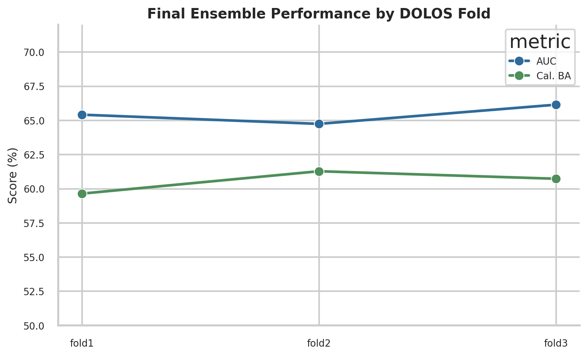

Fold2 có BA@0.5 thấp vì threshold mặc định 0.5 không phù hợp, nhưng sau calibration balanced accuracy tăng lên 61.27. Điều này cho thấy việc calibrate threshold trên validation là cần thiết.

### 7.3 So sánh với DOLOS paper

| Source | Method | ACC | BA | F1 Lie | AUC |
| --- | --- | ---: | ---: | ---: | ---: |
| Paper | Visual | 61.44 | - | 69.42 | 58.89 |
| Paper | Audio | 59.19 | - | 73.46 | 52.54 |
| Paper | Concatenation | 61.62 | - | 70.20 | 60.50 |
| Paper | PAVF | 64.75 | - | 71.20 | 62.71 |
| Paper | PAVF + Multi-task | 66.84 | - | 73.35 | 64.58 |
| Ours | Cross-attention AUC baseline | 56.70 | 57.22 | 48.36 | 61.98 |
| Ours | Gated logits prior-KL | 59.36 | 59.39 | 60.27 | 64.38 |
| Ours | Final ensemble raw-BA | 60.57 | 60.54 | 61.39 | 65.43 |

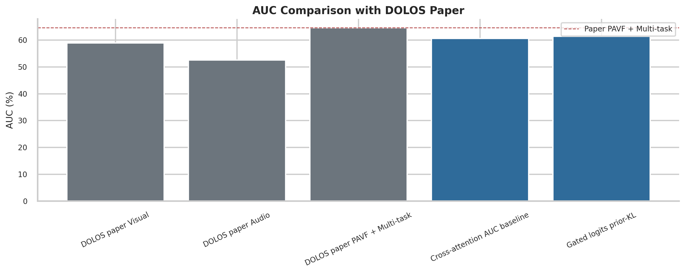

Về AUC, final ensemble đạt 65.43, cao hơn AUC 64.58 của PAVF + Multi-task trong bảng tham chiếu. Tuy nhiên, accuracy và F1 Lie của mô hình trong báo cáo vẫn thấp hơn paper. Điều này cho thấy khả năng ranking của score tương đối tốt, nhưng thresholding và calibration vẫn còn khó. Ngoài ra, DOLOS paper dùng multi-task learning và thiết kế PECL/PAVF riêng, nên so sánh cần được hiểu theo bối cảnh khác biệt về supervision và implementation.

### 7.4 Stream ablation trên fold3

| Run | Stream | Val AUC | Test AUC | Calibrated BA | Calibrated F1 |
| --- | --- | ---: | ---: | ---: | ---: |
| spatial_only | Spatial | 58.41 | 55.80 | 54.06 | 30.63 |
| flow_only | Flow | 56.34 | 57.01 | 54.21 | 62.72 |
| audio_only | Audio | 69.77 | 56.66 | 53.91 | 46.04 |
| full_auc | All streams | 53.48 | 57.93 | 52.58 | 35.69 |
| soft temporal cross | All streams | 60.17 | 64.34 | 58.92 | 70.24 |
| gated prior-KL temporal mask | All streams | 61.64 | 65.46 | 59.08 | 58.39 |

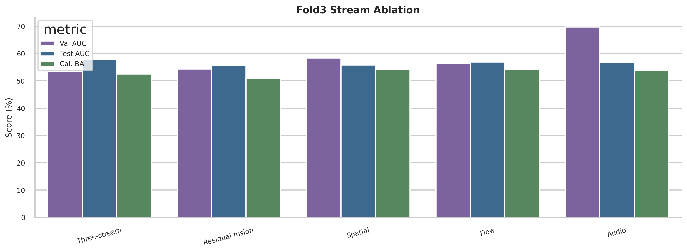

Ablation cho thấy không stream đơn nào đủ ổn định. Audio-only có validation AUC cao nhưng test AUC không vượt trội, cho thấy nguy cơ overfit theo fold. Flow và spatial đều có tín hiệu nhưng calibrated BA chỉ quanh 54. Kết quả tốt nhất xuất hiện khi dùng fusion/ensemble.

### 7.5 Score distribution, ROC, PR và threshold

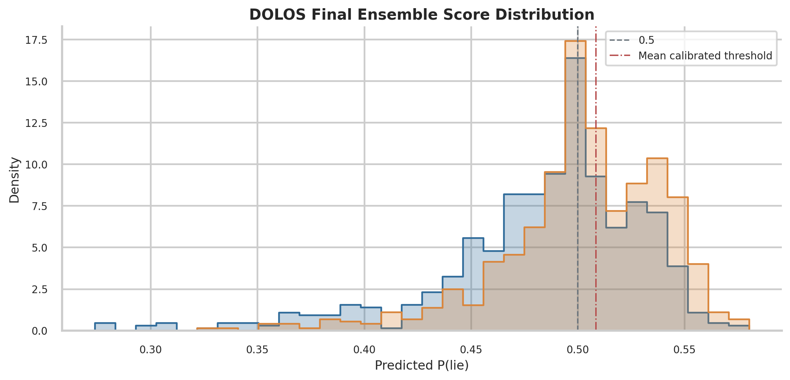

Score distribution của truth và lie vẫn overlap đáng kể. Đây là lý do accuracy/F1 phụ thuộc mạnh vào threshold.

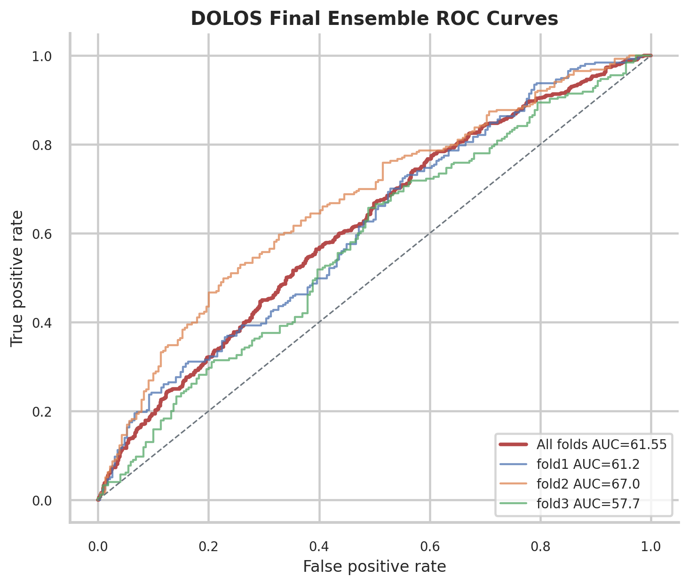

ROC curve cho thấy mô hình có khả năng ranking tốt hơn mức random, nhưng khoảng cách giữa hai lớp chưa lớn.

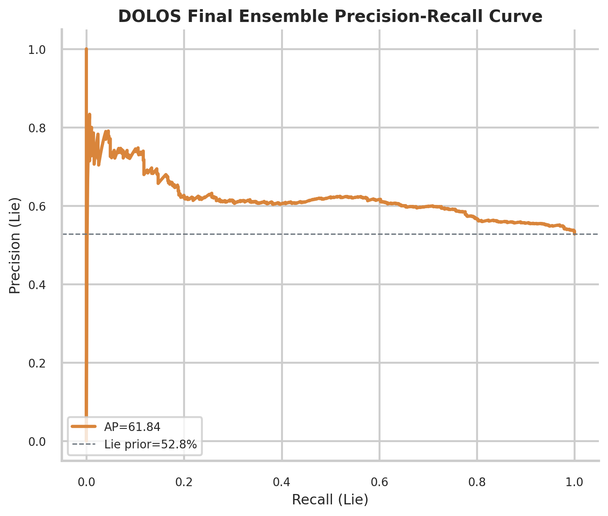

Precision-recall curve phản ánh khó khăn của lớp lie khi threshold thay đổi.

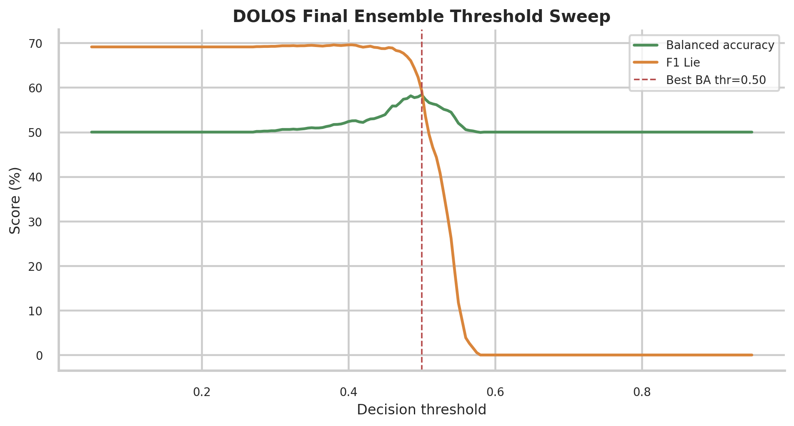

Threshold sweep cho thấy threshold 0.5 không luôn tối ưu, đặc biệt trên fold2. Vì vậy, báo cáo dùng validation-calibrated threshold khi trình bày metric quyết định.

---

## 8. Error analysis

### 8.1 Lỗi theo host

| Host | N | Truth | Lie | BA | Accuracy | AUC | Pred lie rate | TN | FP | FN | TP |
| --- | ---: | ---: | ---: | ---: | ---: | ---: | ---: | ---: | ---: | ---: | ---: |
| SB | 183 | 82 | 101 | 51.70 | 51.37 | 54.06 | 46.99 | 45 | 37 | 52 | 49 |
| YW | 338 | 153 | 185 | 57.72 | 57.99 | 59.66 | 53.55 | 84 | 69 | 73 | 112 |
| AN | 266 | 116 | 150 | 62.02 | 62.78 | 60.80 | 57.52 | 65 | 51 | 48 | 102 |
| BRI | 269 | 158 | 111 | 62.92 | 64.31 | 62.42 | 39.78 | 112 | 46 | 50 | 61 |
| LS | 374 | 166 | 208 | 63.12 | 63.10 | 62.43 | 51.34 | 105 | 61 | 77 | 131 |

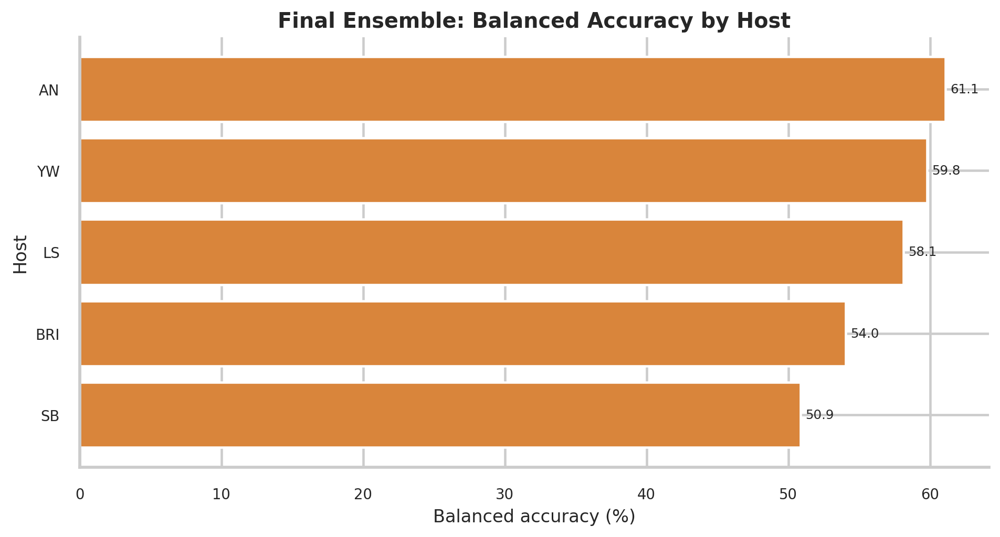

Host SB là nhóm khó nhất với BA chỉ 51.70. Điều này cho thấy mô hình còn bị ảnh hưởng bởi đặc trưng người nói và điều kiện episode, chưa học được representation hoàn toàn bất biến theo host.

### 8.2 Lỗi theo episode

| Episode | N | Truth | Lie | BA | Accuracy | AUC | Pred lie rate |
| --- | ---: | ---: | ---: | ---: | ---: | ---: | ---: |
| SB_EP35 | 19 | 11 | 8 | 26.14 | 26.32 | 53.41 | 52.63 |
| YW_EP46 | 18 | 10 | 8 | 27.50 | 27.78 | 22.50 | 50.00 |
| SB_EP36 | 15 | 6 | 9 | 30.56 | 33.33 | 40.74 | 60.00 |
| YW_EP50 | 30 | 15 | 15 | 33.33 | 33.33 | 35.11 | 70.00 |
| BRI_EP64 | 23 | 15 | 8 | 35.42 | 34.78 | 35.00 | 56.52 |
| YW_EP49 | 22 | 14 | 8 | 36.61 | 36.36 | 31.25 | 54.55 |

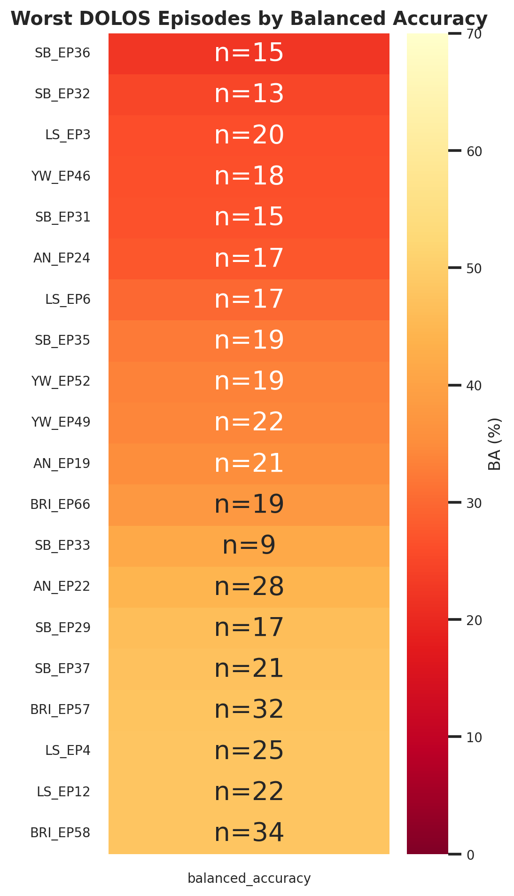

Episode-level error cho thấy một số episode có performance rất thấp dù cùng nằm trong DOLOS. Nguyên nhân có thể đến từ camera cut, shot composition, host-specific behavior hoặc nhiễu face tracking.

### 8.3 Confusion matrix và loại lỗi

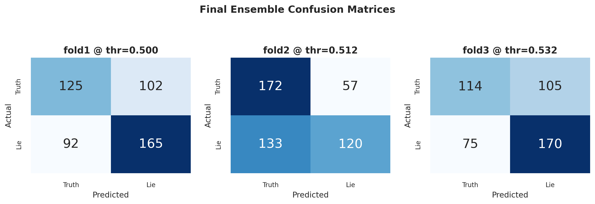

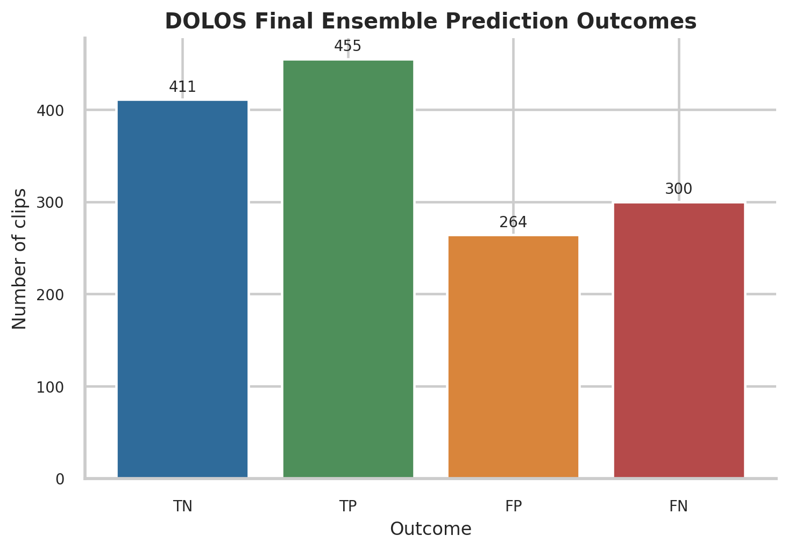

Final ensemble vẫn tạo cả false positive và false negative đáng kể. Fold2 sau calibration giảm false positive khá tốt nhưng recall lie thấp hơn. Fold3 có recall lie cao hơn nhưng false positive tăng.

### 8.4 Face contamination heuristic

| Suspect contamination | N | BA | Accuracy | AUC | Error rate | Mean score lie |
| --- | ---: | ---: | ---: | ---: | ---: | ---: |
| False | 180 | 64.17 | 65.56 | 60.55 | 34.44 | 51.99 |
| True | 1250 | 59.91 | 59.84 | 60.86 | 40.16 | 51.56 |

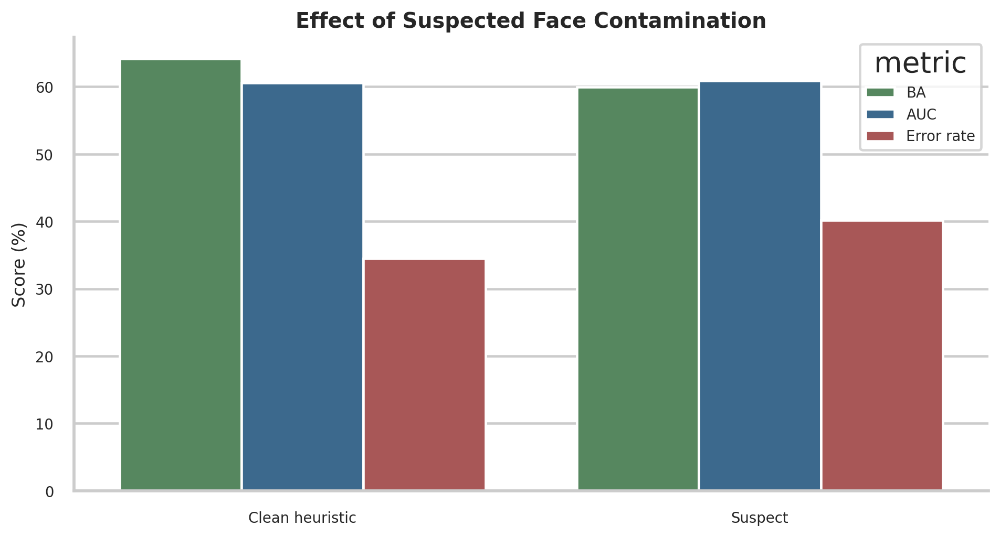

Các clip bị heuristic flag suspect contamination có error rate cao hơn và BA thấp hơn. Điều này củng cố nhận định rằng chất lượng face tracking vẫn là nút thắt quan trọng. Tuy nhiên, AUC giữa hai nhóm không chênh lệch mạnh, nghĩa là contamination không phải nguyên nhân duy nhất; variance theo host/episode cũng đáng kể.

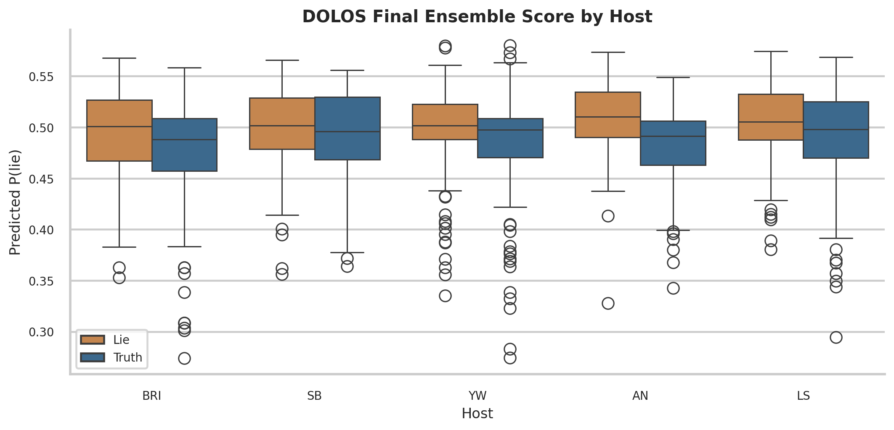

---

## 9. Thảo luận

### 9.1 Mô hình có học được tín hiệu deception không?

Kết quả AUC 65.43 cho thấy mô hình học được tín hiệu phân biệt truth/lie tốt hơn random và tốt hơn các model đơn trong pipeline. Tuy nhiên, calibrated BA 60.54 và F1 Lie 61.39 cho thấy boundary quyết định vẫn chưa thật mạnh. Nói cách khác, mô hình có học được tín hiệu in-domain trên DOLOS, nhưng tín hiệu này yếu và dễ bị ảnh hưởng bởi fold, host, episode và chất lượng visual input.

### 9.2 Gated fusion và ensemble có lợi gì?

Gated prior-KL giúp mô hình bớt phụ thuộc cứng vào một stream, đặc biệt là spatial stream vốn dễ overfit theo identity hoặc face crop. Prediction-level ensemble tiếp tục cải thiện vì soft temporal cross-attention và gated prior-KL mắc lỗi không hoàn toàn giống nhau. Trọng số ensemble thay đổi theo fold:

- fold1 ưu tiên cross-attention soft nhưng vẫn giữ một phần gated.
- fold2 chọn hoàn toàn soft temporal cross-attention.
- fold3 chủ yếu chọn gated prior-KL nhưng thêm một phần nhỏ cross-attention.

Điều này cho thấy không có một stream/fusion nào thống trị mọi fold.

### 9.3 Vì sao kết quả vẫn thấp hơn một số chỉ số của bài gốc?

So với DOLOS paper, báo cáo này có AUC cạnh tranh nhưng accuracy và F1 thấp hơn. Một số nguyên nhân hợp lý:

1. Báo cáo không dùng multi-task labels hoặc supervision phụ như bài gốc.
2. Backbone ViT và Wav2Vec2 được freeze, nên representation chưa được tối ưu sâu cho deception domain.
3. DOLOS có biến thiên mạnh theo host/episode; single seed có thể chưa phản ánh hết độ ổn định.
4. Face contamination và camera cut ảnh hưởng trực tiếp tới spatial/flow stream.
5. Threshold calibration còn khó vì score distribution của truth/lie overlap.

### 9.4 Vai trò của micro-expression

Kết quả không đủ để kết luận micro-expression một mình có thể giải quyết lie detection. Spatial-only trên fold3 chỉ đạt AUC 55.80 và calibrated BA 54.06. Điều này cho thấy khuôn mặt có tín hiệu, nhưng cần kết hợp motion và audio. Báo cáo vì vậy nên được hiểu là một hệ thống **audio-visual lie detection có khai thác micro-expression cues**, thay vì một hệ thống chỉ dựa trên micro-expression.

---

## 10. Kết luận và hướng phát triển

### 10.1 Kết luận

Báo cáo đã xây dựng và đánh giá một pipeline đa phương thức cho bài toán **Micro-Expression for Lie Detection** trên DOLOS. Pipeline gồm face crop clean, optical flow, audio extraction, face_valid masking, three-stream modeling, gated logit fusion và prediction-level ensemble.

Kết quả chính trên DOLOS 3-fold:

| Final method | AUC | Calibrated BA | Calibrated F1 Lie |
| --- | ---: | ---: | ---: |
| `ensemble_raw_balanced_accuracy` | **65.43** | **60.54** | **61.39** |

Kết quả này vượt từng model thành phần về AUC và calibrated BA. Tuy vậy, error analysis cho thấy mô hình vẫn nhạy với host, episode và chất lượng face tracking. Do đó, kết luận phù hợp nhất là: mô hình học được tín hiệu phân biệt trong DOLOS, nhưng tín hiệu còn yếu và chưa đủ ổn định để xem là một deception cue tổng quát.

### 10.2 Hạn chế

- Chỉ chạy single seed.
- ViT và Wav2Vec2 đang frozen, chưa fine-tune domain-specific.
- Face tracking còn nhiều window suspect contamination.
- Không dùng transcript/text modality.
- Không dùng multi-task supervision như DOLOS paper.
- Score distribution của hai lớp còn overlap, làm thresholding khó.

### 10.3 Hướng phát triển

Các hướng đáng thử tiếp theo:

1. Fine-tune nhẹ bằng PEFT/LoRA cho ViT và Wav2Vec2 để thích nghi với DOLOS mà không gây OOM.
2. Dùng pseudo-label Action Units hoặc emotion làm auxiliary task để regularize visual feature.
3. Cải thiện face-track clustering và visual quality mask.
4. Chạy multi-seed để báo cáo mean và confidence interval ổn định hơn.
5. Thêm text/transcript stream nếu có transcript tin cậy.
6. Thử metric learning hoặc supervised contrastive learning để giảm học lệch theo host.

---

## Tài liệu tham khảo

1. Guo et al., “Audio-Visual Deception Detection: DOLOS Dataset and Parameter-Efficient Crossmodal Learning”, ICCV 2023.
   `https://openaccess.thecvf.com/content/ICCV2023/papers/Guo_Audio-Visual_Deception_Detection_DOLOS_Dataset_and_Parameter-Efficient_Crossmodal_Learning_ICCV_2023_paper.pdf`

2. ROSE Lab DOLOS Dataset page.
   `https://rose1.ntu.edu.sg/dataset/DOLOS/`

3. Baevski et al., “wav2vec 2.0: A Framework for Self-Supervised Learning of Speech Representations”, NeurIPS 2020.

4. Dosovitskiy et al., “An Image is Worth 16x16 Words: Transformers for Image Recognition at Scale”, ICLR 2021.

---

## Phụ lục A. Artifact và nguồn số liệu

| Nội dung | File |
| --- | --- |
| Final report mới nhất | `outputs/metrics/final_report_clean_temporal_mask_soft_cross/final_results_summary.md` |
| Final table | `outputs/metrics/final_report_clean_temporal_mask_soft_cross/final_results_table.csv` |
| Per-fold metrics | `outputs/metrics/final_report_clean_temporal_mask_soft_cross/final_per_fold_metrics.csv` |
| Error analysis | `outputs/metrics/final_report_clean_temporal_mask_soft_cross/final_error_analysis.md` |
| Soft temporal summary | `outputs/metrics/retrain_clean_dolos_three_stream_auc_soft_temporal_penalty/soft_temporal_penalty_summary.md` |
| Stream ablation | `outputs/metrics/fold3_stream_ablation/fold3_stream_ablation_summary.md` |
| Main figures | `docs/figures/report/` |
