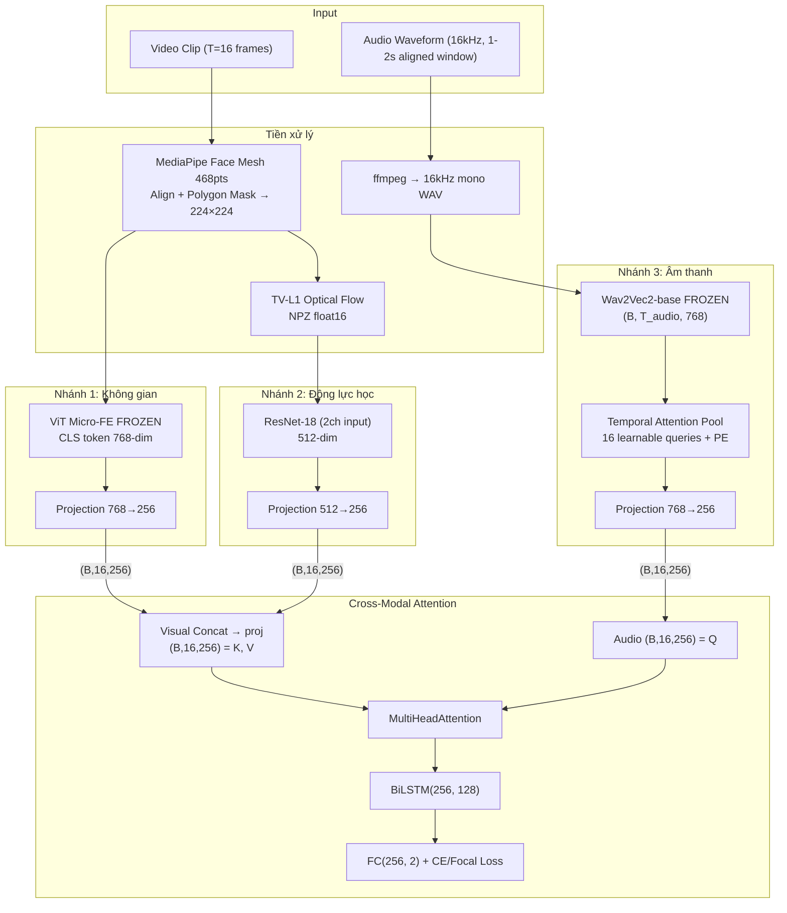

# Kế hoạch Báo cáo Môn học: Phân tích Lừa dối Đa phương thức

## Three-Stream Architecture

**ViT Micro-FE (Không gian) + Optical Flow (Thời gian) + Wav2Vec2 (Âm thanh)**

Kiến trúc 3 luồng lấy cảm hứng từ lý thuyết tâm lý học:
- **Nhánh 1 — Không gian**: ViT pretrained micro-expressions → proxy cho FACS-related facial cues / vi biểu cảm tĩnh
- **Nhánh 2 — Động lực học**: TV-L1 Optical Flow + ResNet-18 → temporal motion patterns consistent with micro-expression leakage
- **Nhánh 3 — Âm thanh**: Wav2Vec2 frozen → proxy cho paralinguistic / cognitive-load cues

**Fusion**: Temporal-Aligned Cross-Modal Attention → BiLSTM → Classifier

**Dataset**: DOLOS (1462 usable clips, 3-fold)

---

## Kết quả Rà soát Dữ liệu

| Item | DOLOS |
|------|-------|
| Total / Usable | 1472 / 1462 |
| Corrupt (<1KB) | 10 files |
| Audio track | 100% |
| Labels | truth/deception (cần normalize) |
| Behavioral annotations | 41 cột binary |

**Quyết định**: không multi-task emotion. DOLOS có đủ audio nên pipeline chính dùng multimodal 3-stream. Loss chọn sau khi kiểm tra imbalance từng fold: dùng CE nếu imbalance <10%, dùng Focal Loss nếu imbalance đáng kể.

---

## Confirmed Decisions

| Vấn đề | Giải pháp |
|--------|-----------|
| GPU | RTX 3060 12GB (local) / Colab A100 (backup); bắt buộc smoke test VRAM trước khi train |
| Nhánh 1 | ViT `LaurenGurgiolo/vit-micro-facial-expressions` — frozen |
| Face preprocessing | MediaPipe Face Mesh 468 landmarks + Polygon Masking (chống Data Leakage) |
| OptFlow storage | `.npz float16` cho `flow_x/flow_y`; ưu tiên giữ tín hiệu micro-motion, chỉ dùng PNG/JPEG nếu cần debug trực quan |
| Fusion | Temporal Attention Pooling (learnable queries) + Cross-Modal Attention |
| Seed | 3 seeds (42, 1337, 2025) nếu đủ thời gian; tối thiểu seed 42 và ghi limitation |

---

## Giai đoạn 1 — Tiền xử lý Dữ liệu (Tuần 1)

### 1.1 Metadata & Audio

#### [NEW] `src/data/dolos_prepare.py`
- Normalize labels (Lie=1, Truth=0), gender, filter 10 corrupt files
- Dùng annotation/download set có sẵn trong `data/DOLOS`: `dolos_timestamps.csv` + `Training_Protocols/train_fold{1,2,3}.csv`, `test_fold{1,2,3}.csv`
- Nếu video chưa có: chạy `src/data/download_dolos_videos.py` để tải clip từ YouTube theo `dolos_timestamps.csv`
- Chia 3-fold group-aware theo `{HOST}_EP{N}` (speaker/episode)
- Trước khi split: kiểm tra metadata có `subject_id`, `person_id`, `speaker_id` hoặc `person_name` không; nếu có, ưu tiên group theo identity thay vì episode
- In/log phân phối label từng fold: `df.groupby('fold')['label'].value_counts()`
- Nếu không xác minh được identity across episodes: ghi limitation "grouped by episode; subject identity across episodes not verified"
- Validation split tách từ train fold theo group; test fold chỉ dùng một lần để báo cáo
- Output: `data/processed/splits/dolos/fold{1,2,3}_{train,val,test}.csv`

#### [NEW] `src/data/extract_audio.py`
- Video → WAV 16kHz mono
- Output: `data/processed/audio/dolos/{video_id}.wav`

#### [NEW] `src/data/download_dolos_videos.py`
- Input: `data/DOLOS/dolos_timestamps.csv`
- Tool: `yt-dlp` hoặc `youtube-dl`
- Output: `data/raw/dolos/videos/{file_name}.mp4`
- Manifest: `data/raw/dolos/videos/download_manifest.csv`

### 1.2 MediaPipe Face Masking

#### [NEW] `src/data/preprocess_faces_mediapipe.py`
1. MediaPipe Face Mesh 468 landmarks
2. Target-face selection:
   - Chọn face có bounding box lớn nhất ở frame đầu có detection hợp lệ
   - Track qua các frame sau bằng IoU temporal consistency
   - Nếu IoU với target trước đó <0.3 hoặc target mất quá ngưỡng: re-initialize bằng face lớn nhất/gần center nhất, không interpolate mù
   - Nếu nhiều face cùng size: chọn face gần center frame hơn
3. Motion Registration (sống mũi/trán → triệt tiêu head pose)
4. Polygon Masking (bôi đen background → chống Data Leakage)
5. Crop 224×224, resample 25fps
- Robustness:
  - Nếu landmark fail ngắn hạn: dùng transform/frame hợp lệ gần nhất hoặc interpolate
  - Nếu fail quá ngưỡng: ghi vào manifest và loại clip khỏi usable set
  - Lưu `preprocess_manifest.csv`: số frame, fps gốc, fps sau resample, tỷ lệ landmark fail, số frame multi-face
- Output: `data/processed/faces_224_clean/{dataset}/{video_id}/`

### 1.3 Optical Flow (`.npz float16`)

#### [NEW] `src/data/extract_optical_flow.py`
- TV-L1 trên face frames đã căn chỉnh, polygon-masked, crop 224×224 và resample 25fps
- OptFlow extract **sau** MediaPipe alignment/resample và từ đúng frame sequence mà RGB branch sử dụng để giữ shape/timestamp khớp
- Clip flow về [-20, 20], lưu `.npz float16` để giữ tín hiệu micro-motion
- Mỗi file chứa `flow` shape `(T, 2, 224, 224)` và optional `timestamps`
- Khi train: load `float16`, cast sang `float32` trước khi đưa vào model nếu cần ổn định
- PNG/JPEG chỉ dùng cho debug trực quan, không dùng làm storage chính
- Output: `data/processed/optflow/{dataset}/{video_id}.npz`

### 1.4 Dataloader

#### [NEW] `src/data/multimodal_dataset.py`

```python
class MultimodalClipDataset(Dataset):
    """
    Returns: rgb_frames (T,3,224,224), optflow_frames (T,2,224,224),
             audio_waveform (S,), label, video_id
    T=16 frames, audio segment aligned to selected 1-2s video window,
    audio max 2s (32000 samples @16kHz)
    Train augmentation only: RandomErasing (RGB),
    speed perturbation (audio) with rate range [0.9, 1.1]
    """
```

**Temporal sampling/alignment**:
- Chuẩn hóa video về 25fps sau face preprocessing
- Training: mỗi clip sinh `num_windows_per_clip_train=3` random dense windows 1-2s/epoch, mỗi window lấy 16 frame uniform để giảm window-level label noise
- Nếu clip ngắn hơn `window_seconds`: sinh 1 full-clip window duy nhất và lấy 16 frame bằng repeat/interpolation, không repeat 3 windows giống hệt nhau
- Validation/test: tắt toàn bộ augmentation; full-clip sliding windows 1-2s, stride 0.5-1s; nếu số windows > `max_windows_per_clip` thì lấy evenly-spaced windows để phủ đều clip; logit clip = mean logits của các window
- Audio: cắt đúng timestamp của video window; pad bằng 0 nếu ngắn hơn window length
- Audio speed perturbation chỉ dùng khi train, giới hạn [0.9, 1.1], sau perturb crop/pad về đúng `window_seconds` để giảm lệch alignment audio-video
- Optical flow: frame `t` ứng với chuyển động giữa RGB frame `t` và `t+1`; pad/trim để giữ shape `(T,2,224,224)`
- Limitation cần ghi trong báo cáo: window-level labels kế thừa clip-level labels, nên không phải mọi 2s window trong clip lie đều chứa deception cue; MIL-style aggregation để Future Work

**I/O**: `num_workers=min(cpu_count(), 4)` để tránh OOM RAM trên Colab, `pin_memory=True`, ưu tiên SSD NVMe

---

## Giai đoạn 2 — Kiến trúc 3 Luồng (Tuần 2)

### 2.1 Nhánh 1 — Không gian (ViT Micro-FE)

#### [NEW] `src/models/branch_visual_vit.py`

```python
class SpatialViTBranch(nn.Module):
    """
    ViT pretrained micro-expressions — FROZEN.
    Input: (B*T, 3, 224, 224) → CLS token 768-dim
    → Projection(768, 256) + LN + GELU → reshape (B, T, 256)
    """
```

### 2.2 Nhánh 2 — Động lực học (OptFlow + ResNet-18)

#### [NEW] `src/models/branch_visual_optflow.py`

```python
class TemporalFlowBranch(nn.Module):
    """
    ResNet-18 (conv1 modified 3ch→2ch).
    Input: (B*T, 2, 224, 224) → 512-dim
    → Projection(512, 256) + LN + GELU → reshape (B, T, 256)
    """
```

### 2.3 Nhánh 3 — Âm thanh (Wav2Vec2)

#### [NEW] `src/models/branch_audio_wav2vec.py`

```python
class TemporalAttentionPool(nn.Module):
    """16 learnable queries + Sinusoidal PE attend to T_audio timesteps.
    Output: (B, 16, 768)"""
    def __init__(self, dim=768, T_out=16, num_heads=4):
        self.query = nn.Parameter(torch.randn(T_out, dim))
        # Sinusoidal PE: "đánh số" queries 1→16 giúp hội tụ nhanh
        pe = sinusoidal_encoding(T_out, dim)
        self.register_buffer('pe', pe)
        self.attn = nn.MultiheadAttention(dim, num_heads, batch_first=True)
    def forward(self, x):
        q = (self.query + self.pe).unsqueeze(0).expand(x.size(0), -1, -1)
        out, _ = self.attn(q, x, x)
        return out

class AudioBranch(nn.Module):
    """
    Wav2Vec2-base — FROZEN by default.
    Input: (B, S) → hidden states (B, T_audio, 768)
    → TemporalAttentionPool → (B, 16, 768)
    → Projection(768, 256) → (B, 16, 256)
    """
```

**Fallback nếu audio branch yếu**:
- Mặc định freeze Wav2Vec2 để giảm VRAM và overfit
- Nếu validation F1 không cải thiện: thử unfreeze 2-4 transformer layers cuối với lr nhỏ `1e-5`
- Có thể thêm feature phụ rẻ: energy, pitch proxy, speech rate nếu cần giải thích cận ngôn ngữ

### 2.4 Fusion — Cross-Modal Attention

#### [NEW] `src/models/fusion_cross_attention.py`

```python
class CrossModalFusion(nn.Module):
    """
    "Lúc giọng ngập ngừng nhất = lúc cần soi mặt kỹ nhất"

    1. Visual = Concat[Spatial, Temporal] (B,16,512) → proj → (B,16,256) = K, V
    2. Audio (B,16,256) = Q
    3. MultiHeadAttention(Q, K, V) → (B, 16, 256)
    4. BiLSTM(256, 128, 2L) → (B, 256)
    5. FC(256, 2) + CE/Focal Loss (auto by imbalance)
    """
```

### 2.5 Loss

#### [NEW] `src/models/losses.py`
- Default: `CrossEntropyLoss` nếu imbalance từng train fold <10%
- Fallback: Focal Loss `gamma=2.0`, `alpha` auto-computed nếu train fold imbalance đáng kể hoặc CE collapse về majority class

---

## Giai đoạn 3 — Huấn luyện (Tuần 3)

### 3.1 Training Pipeline

#### [NEW] `src/train_multimodal.py`
- YAML config, AdamW, CosineAnnealingWarmRestarts (warmup 3 epochs)
- ViT + Wav2Vec2: frozen. ResNet-18 + fusion heads: lr=1e-3
- Batch 8, grad accumulation 2, AMP
- Early stopping patience=10 on val_f1_lie, max 50 epochs

#### [NEW] `src/utils/estimate_vram.py`
- Smoke test forward pass trước khi train: batch clips `1 → 2 → 4 → 8`
- Khi `num_windows_per_clip_train=3`, effective batch theo window là `batch_size * 3`; VRAM test phải tạo đúng số windows này
- Với `gradient_accumulation=2`: effective batch/update = 16 clips = 48 windows/update; ghi rõ khi so sánh với PECL/baseline
- Log `torch.cuda.max_memory_allocated()` và batch size lớn nhất chạy ổn trên RTX 3060 12GB
- Nếu OOM:
  - Giảm `batch_size`, tăng `gradient_accumulation`
  - Giảm `num_windows_per_clip_train` từ 3 xuống 2/1 nếu cần
  - Hoặc precompute frozen features của ViT/Wav2Vec2 ra disk để train ResNet-18 + fusion nhẹ hơn
  - Hoặc chuyển full model sang Colab A100

**📊 W&B tracking bắt buộc từ epoch 1**:
- Tag: `{dataset}_{mode}_{fold}_{seed}` → VD: `dolos_multimodal_fold1_seed42`
- Auto-log: config, learning curves, best checkpoint

### 3.2 Experiments

| # | Config | Dataset | Mode |
|---|--------|---------|------|
| 0 | PECL (DOLOS paper baseline) | DOLOS 3-fold | reported |
| 1 | **Ablation: RGB-only** (ViT) | DOLOS fold 1 + fold 2; 3-fold nếu đủ thời gian | visual |
| 2 | **Ablation: Audio-only** | DOLOS fold 1 + fold 2; 3-fold nếu đủ thời gian | audio |
| 3 | **Ablation: RGB + OptFlow** | DOLOS fold 1 + fold 2; 3-fold nếu đủ thời gian | visual |
| 4 | **Three-Stream + Cross-Attn (Full)** | DOLOS 3-fold | main |
| 5 | Optional: Three-stream + simple concat/no BiLSTM | DOLOS fold 1 + fold 2 nếu còn thời gian | fusion ablation |

**Ưu tiên nếu thiếu thời gian**:
1. Full model DOLOS 3-fold
2. Ablation tối thiểu trên fold 1 + fold 2: RGB-only, audio-only, RGB+OptFlow
3. Optional fusion ablation: simple concat/no BiLSTM để kiểm tra đóng góp của Cross-Attn/BiLSTM
4. Multi-seed cho full model nếu còn GPU budget

### 3.3 Fixed Hyperparameters

```yaml
optimizer: adamw
lr_head: 1e-3
weight_decay: 0.01
scheduler: cosine_warmup (T_0=10, warmup=3)
batch_size: 8
gradient_accumulation: 2
frames_per_clip: 16
window_seconds: 2
num_windows_per_clip_train: 3  # effective windows/step = batch_size * num_windows_per_clip_train
sliding_stride_seconds: 1
max_windows_per_clip: 16
speed_perturb_range: [0.9, 1.1]  # train only; crop/pad back to window_seconds
num_workers: 4  # cap worker count to avoid Colab RAM OOM
early_stopping: patience=10 on val_f1_lie
max_epochs: 50
loss: auto  # ce nếu per-fold imbalance <10%, focal nếu imbalance đáng kể
focal_loss_gamma: 2.0  # chỉ dùng khi loss=focal
seeds: [42, 1337, 2025]  # nếu đủ thời gian; fallback: [42]
# effective clips/update = batch_size * gradient_accumulation = 16
# effective windows/update = batch_size * num_windows_per_clip_train * gradient_accumulation = 48
```

---

## Giai đoạn 4 — Đánh giá & Báo cáo (Tuần 4)

### 4.1 Metrics
- **Primary**: F1-Lie, Accuracy, AUC-ROC
- **Secondary**: Precision-Lie, Recall-Lie, Balanced Accuracy, Confusion Matrix
- **Window aggregation variants**: default mean logits; log thêm max logits và top-3 mean logits trong `src/evaluate.py` để so sánh hậu kỳ không cần train lại
- Kết quả chính thức dùng checkpoint chọn theo `val_f1_lie` từ mean-pooled logits; max/top-3 chỉ là post-hoc analysis, không dùng để claim main result nhằm tránh checkpoint selection bias
- Report: `mean ± std` across 3 folds
- Nếu chỉ chạy 1 seed: báo cáo rõ "single-seed limitation"; nếu chạy nhiều seed: report `mean ± std` across folds × seeds

### 4.2 Visualization (chọn 1 trong 2)
- **Grad-CAM trên OptFlow** (ResNet-18): vùng cơ nào giật khi nói dối?
- HOẶC **Attention Rollout trên ViT**: vùng mặt nào ViT chú ý?

### 4.3 Báo cáo

Cấu trúc — nhấn mạnh **mapping tâm lý học → Deep Learning**:

1. **Giới thiệu**: Vấn đề phát hiện lừa dối, gap, đóng góp
2. **Phương pháp đề xuất**:
   - ViT as proxy for FACS-related facial cues
   - OptFlow capturing temporal motion patterns consistent with micro-expression leakage
   - Wav2Vec2 as proxy for paralinguistic / cognitive-load cues
   - MediaPipe Masking — prevents spatial data leakage
   - Cross-Modal Attention — aligns paralinguistic cues with visual dynamics
3. **Thực nghiệm**: DOLOS 3-fold strict clean protocol
4. **Kết quả**: Bảng so sánh vs PECL, ablation, error analysis, visualization
5. **Kết luận**

---

## Architecture Diagram



---

## File Summary

## Project Structure

```text
configs/
  multimodal_dolos.yaml
data/
  raw/
    dolos/
  processed/
    audio/
    faces_224_clean/
    optflow/
    splits/
docs/
  multimodal_plan.md
outputs/
  checkpoints/
  logs/
  metrics/
src/
  data/
    dolos_prepare.py
    download_dolos_videos.py
    extract_audio.py
    preprocess_faces_mediapipe.py
    extract_optical_flow.py
    multimodal_dataset.py
    visualize_results.py
  models/
    branch_visual_vit.py
    branch_visual_optflow.py
    branch_audio_wav2vec.py
    fusion_cross_attention.py
    losses.py
  utils/
    io.py
    seed.py
    estimate_vram.py
  evaluate.py
  train_multimodal.py
```

Không tạo `src/utils.py`; `src/utils/` là package riêng để tránh xung đột import khi chạy `python -m src.utils.estimate_vram`.

| Action | File | Component |
|--------|------|-----------|
| NEW | `src/data/dolos_prepare.py` | Metadata cleaning |
| NEW | `src/data/download_dolos_videos.py` | Download DOLOS clips from timestamps |
| NEW | `src/data/extract_audio.py` | Audio extraction |
| NEW | `src/data/preprocess_faces_mediapipe.py` | MediaPipe Masking |
| NEW | `src/data/extract_optical_flow.py` | TV-L1 OptFlow → `.npz float16` |
| NEW | `src/data/multimodal_dataset.py` | 3-stream dataloader |
| NEW | `src/models/branch_visual_vit.py` | ViT Micro-FE |
| NEW | `src/models/branch_visual_optflow.py` | ResNet-18 OptFlow |
| NEW | `src/models/branch_audio_wav2vec.py` | Wav2Vec2 + TAP |
| NEW | `src/models/fusion_cross_attention.py` | Cross-Modal Attention |
| NEW | `src/models/losses.py` | CE/Focal Loss selection |
| NEW | `src/train_multimodal.py` | Training pipeline |
| NEW | `src/utils/estimate_vram.py` | VRAM smoke test |
| NEW | `src/utils/io.py` | JSON/YAML/path helpers |
| NEW | `src/utils/seed.py` | Reproducibility helpers |
| NEW | `src/data/visualize_results.py` | Grad-CAM / Attention Rollout |
| NEW | `configs/multimodal_dolos.yaml` | Config |
| NEW | `src/evaluate.py` | F1-lie, drop rate, mean/max/top-3 window aggregation |
| NEW | `requirements.txt` | Dependencies |

## Dependencies

```
torch>=2.0.0
torchvision>=0.15.0
torchaudio>=2.0.0
transformers>=4.35.0
mediapipe>=0.10.0
opencv-contrib-python
pytorch-grad-cam>=1.5.0
scikit-learn
scipy
wandb
```

## Timeline (4 tuần)

| Mốc | Deliverables |
|-----|--------------|
| Tuần 1A | Metadata/splits, audio extraction, MediaPipe target-face masking + manifest |
| Tuần 1B | OptFlow `.npz float16`, cache verification, dataloader với dense/sliding windows |
| Tuần 2 | 3 branches + fusion coded, forward pass + VRAM smoke test verified |
| Tuần 3 | Train multimodal DOLOS 3-fold |
| Tuần 4 | Metrics, visualization, viết báo cáo |
